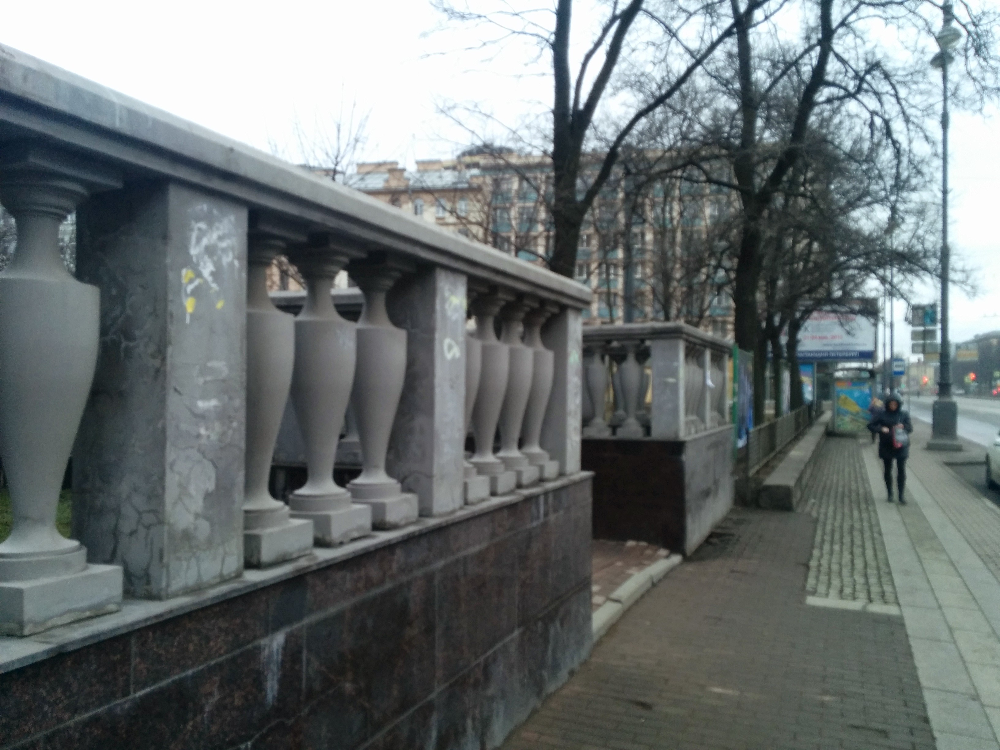
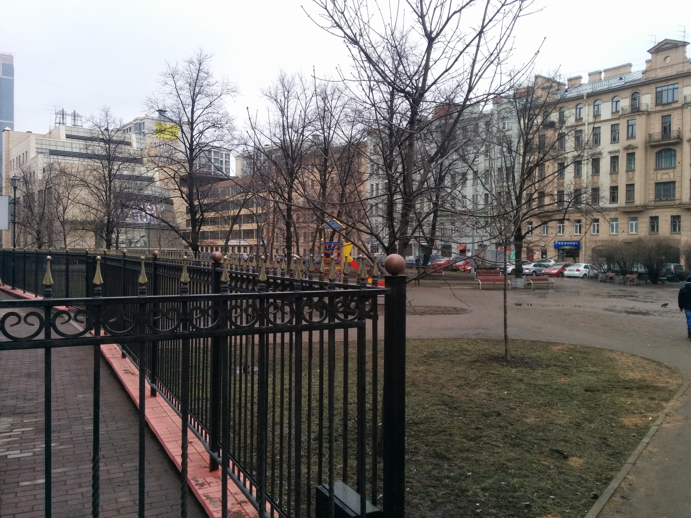
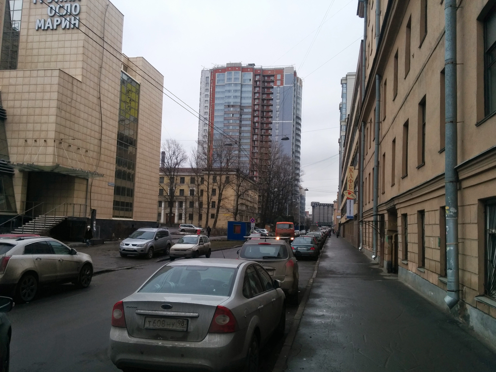
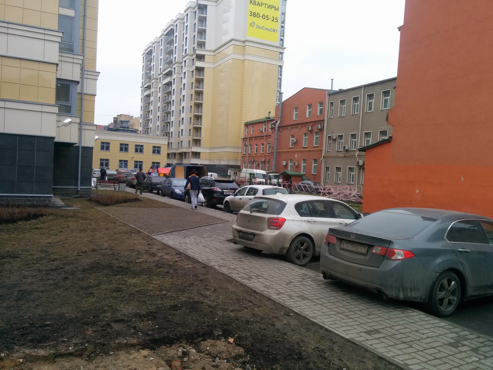

+++
title="Смоленская, д.9"
description="Добиралово до квартиры в городе"
+++
## Адрес
м. Фрунзенская, ул. Смоленская д.9 к. 3 кв. 128 (9ый этаж)

<iframe jsname="L5Fo6c" class="YMEQtf" sandbox="allow-scripts allow-popups allow-forms allow-same-origin allow-popups-to-escape-sandbox" aria-label="Map" src="https://maps-api-ssl.google.com/maps?hl=en-US&amp;ll=59.903493,30.322979&amp;output=embed&amp;q=59.903343,30.322148+(%D0%9C%D0%B5%D1%81%D1%82%D0%BE%D0%BF%D0%BE%D0%BB%D0%BE%D0%B6%D0%B5%D0%BD%D0%B8%D0%B5+%D0%B1%D0%B5%D0%B7+%D0%BD%D0%B0%D0%B7%D0%B2%D0%B0%D0%BD%D0%B8%D1%8F)&amp;z=17" allowfullscreen="" frameborder="0"></iframe>

## Как дойти
Выходите из метро Фрунзенская, сразу же переходите Московский проспект и отправляйтесь направо.

Не доходя первого перекрестка, поворачивайте налево, за домом с башенкой:

И идите наискосок через детскую площадку

Переходите через Смоленскую улицу и сворачивайте в арку через дорогу от большой надписи «Группа Осло Марин»

Вот так выглядит арка:

Войдя в арку, идите все время прямо, к той большой красной стене:

У нее поверните налево и пройдите между стеной и светло-желтым домом.

Вам нужен третий подъезд в желтом доме слева, квартира 128. Домофон должен работать.

Этаж 9ый, квартира подписана номером (128)

Если потеряетесь, звоните +7 921 777 68 55